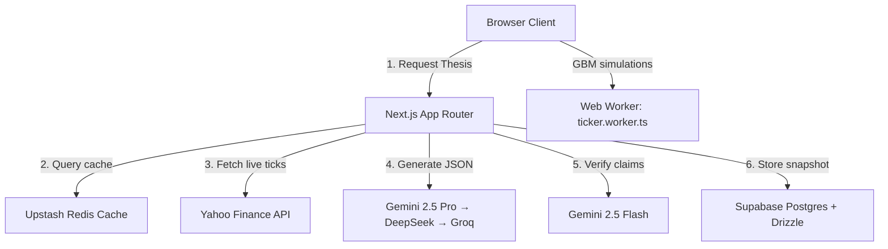

# Editorial Quant: AI-Grounded Stock Thesis & Portfolio Engine

An institutional-grade research platform and portfolio analytics dashboard for Nifty 50 equities. **Editorial Quant** solves the problem of "vibe-based" AI hallucinations in finance by employing a strict two-pass grounding and verification engine, backed by correlated Monte Carlo simulations and macroeconomic stress testing.

---

## 1. Product Vision & Value Proposition

Retail and institutional investors alike face a deluge of qualitative noise. Generative AI can summarize news but frequently hallucinates numbers, trends, and key metrics. 

**Editorial Quant** bridges the gap between deep qualitative reasoning and hard mathematical verification:
- **Zero-Hallucination Mandate**: Every numeric claim generated in an investment thesis is programmatically cross-referenced and verified against live tick data from Yahoo Finance.
- **Interactive Grounding**: Claim references are completely transparent. Users click inline verification pills to reveal the mathematical proof, source data, and news headlines in a portal-rendered Evidence Drawer.
- **Correlated Portfolio Projections**: Moves past static spreadsheets by simulating asset allocations using correlated Geometric Brownian Motion (GBM) Monte Carlo paths, including macro-stress testing.

---

## 2. Core Capabilities & Feature Roadmap

### 📊 Two-Pass Grounded Thesis Generator
- **Generation Pass**: Gemini 2.5 Pro generates structured JSON content covering thesis summaries, bull cases, bear cases, risks, and catalysts.
- **Verification Pass**: Gemini 2.5 Flash isolates every numerical or statistical claim and verifies it against live stock statistics.
- **Visual Validation**: Claims are labeled with color-coded pills (Mint green for verified, Warm Sand for unverified).
- **AI Cascade**: Gemini 2.5 Pro → Gemini 2.5 Flash → Gemini 2.0 Flash → DeepSeek V3 → Groq Llama 3.3 70B (automatic fallback on quota exhaustion).

### 🔍 Interactive Evidence Drawer & D3 Annotations
- **Slide-in Evidence Portal**: Clicking a citation badge or verification pill launches a side panel displaying the factual verification reason, primary news links, and raw JSON data snapshots.
- **Data-Bound Annotations**: Visual event pins are dynamically drawn on a pure D3.js line chart. Clicking an event pin triggers the Evidence Drawer to review the news catalyst that caused the market movement.

### 📈 Correlated GBM Simulation & Stress Testing
- **Correlated Monte Carlo**: Select up to 5 Nifty 50 stocks to calculate their covariance matrix over a 1-year daily log-return timeframe.
- **Dynamic Allocation**: Drag weight sliders to instantly run 10,000 portfolio projection paths, rendering a percentile-band fan chart (p5/p25/p50/p75/p95).
- **Macro-Shock Simulator**: Test portfolio resilience under predefined stress scenarios (e.g., Covid-19 Crash, High Inflation, Tech Selloff) to compare the base portfolio against the shocked portfolio on a dual fan chart.

### ⚡ Off-Thread Ticker Engine
- A horizontal ticker strip scrolls simulated live pricing updates for 20 Nifty 50 stocks at 60fps.
- Driven by a background Web Worker (`ticker.worker.ts`) executing Geometric Brownian Motion updates, avoiding main-thread DOM thrashing.

---

## 3. Technology Stack & Architecture



### Frontend / Client
- **Framework**: Next.js 16.2.6 (App Router) using Turbopack.
- **Styling**: Tailwind CSS + Vanilla CSS Tokens (High-contrast Institutional Dark Mode).
- **Typography**: Variable Serif font *Fraunces* (loaded via `next/font`) & *Geist Mono*.
- **Graphics**: D3.js (annotated price charts) and HTML5 Canvas (ticker strip).
- **Animations**: `framer-motion` (Evidence Drawer transitions, active indicators).

### Backend / Infrastructure
- **Hosting & Serverless**: Vercel Serverless Functions.
- **Database**: Supabase PostgreSQL with Drizzle ORM.
- **Caching**: Upstash Redis (falling back to memory when environment vars are absent).
- **AI Models**: Google Gemini SDK (`@google/genai`), DeepSeek V3, Groq Llama 3.3 70B (free fallbacks).
- **Notifications**: Price alerts (browser push), watchlist, personalised news digest.
- **Developer API**: `/api/v2/` with API key auth, per-key rate limiting, consistent JSON envelope.

---

## 4. Local Setup & Environment Variables

### Prerequisites
- Node.js (v18.x or higher)
- Supabase account (or local Postgres instance)
- Gemini API Key

### Installation

1. **Clone the Repository**:
   ```bash
   git clone https://github.com/rajyyug1132/stock-thesis-generator.git
   cd stock-thesis-generator/Stocks
   ```

2. **Install Dependencies**:
   ```bash
   npm install
   ```

3. **Configure Environment Variables**:
   Create a `.env` file in the root of the `/Stocks` directory and fill in the required keys:
   ```env
   # Database connection (Supabase)
   DATABASE_URL="postgresql://..."
   DIRECT_URL="postgresql://..."

   # AI Thesis Engine (cascade: Gemini → DeepSeek → Groq)
   GEMINI_API_KEY="AIzaSy..."
   GROQ_API_KEY="gsk_..."       # Free at console.groq.com — recommended
   DEEPSEEK_API_KEY="sk-..."    # Optional paid fallback

   # Supabase Client Credentials
   NEXT_PUBLIC_SUPABASE_URL="https://..."
   NEXT_PUBLIC_SUPABASE_ANON_KEY="..."
   SUPABASE_SERVICE_ROLE_KEY="..."

   # Caching Layer (Optional - falls back to memory if empty)
   UPSTASH_REDIS_REST_URL=""
   UPSTASH_REDIS_REST_TOKEN=""

   # Deployment Origin URL
   NEXT_PUBLIC_APP_URL="http://localhost:3000"
   ```

4. **Run Database Migrations**:
   Push the schema snapshot to Supabase:
   ```bash
   npx drizzle-kit push
   ```

5. **Start Development Server**:
   ```bash
   npm run dev
   ```
   Open [http://localhost:3000](http://localhost:3000) in your browser.

---

## 5. Build & Deployment Specifications

### Production Compilation
Ensure the Next.js bundle compiles with strict type safety:
```bash
npm run build
```

### Accessibility Compliance (A11y)
The application adheres to WCAG AA contrast standards:
- Interactive SVGs and D3 annotation nodes carry `role="button"` and `aria-label` attributes.
- Purely decorative elements (like trend indicator triangles) are wrapped in `aria-hidden="true"`, using `.sr-only` text blocks for screen readers.
- Background image containers utilize Next.js `Image` optimizing LCP targets.
