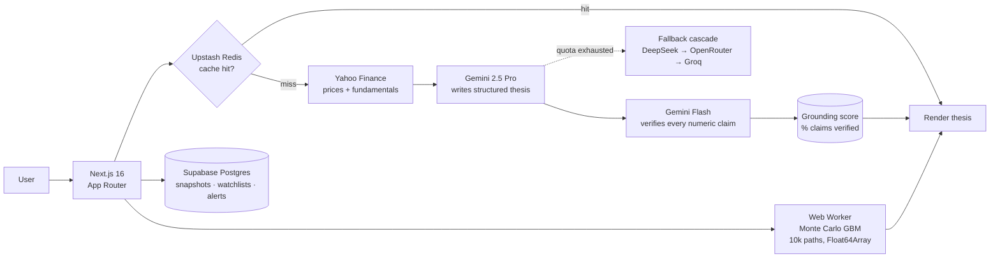

# Editorial Quant — AI-Grounded Stock Thesis Engine

    

I built this because every "AI stock analyzer" I tried just asks an LLM to talk about a company and hopes it doesn't make up numbers. This one fetches real market data first, shows it to you, then writes the analysis from those numbers and nothing else.

**Live:** [stock-thesis-generator-mae5.vercel.app](https://stock-thesis-generator-mae5.vercel.app) · **Scope:** Nifty 50 only

---

## What it does

Type a Nifty 50 ticker on the home page or navigate to `/stock/RELIANCE`. Here's what happens in order:

**Immediately** — the app fetches 1 year of daily price data and the fundamentals (P/E, P/B, ROE, debt/equity, dividend yield, market cap) from Yahoo Finance. These show up on screen before the AI does anything. You see the actual numbers.

**Then** — two AI calls run back to back. The first generates the thesis: a structured document with an executive summary, bull case (3–4 points, each citing a specific number from the data), bear case (3–4 opposing points, same rule), risk factors with severity ratings, and upcoming catalysts with timeframes. The second AI call is a verification pass — it reads the thesis back against the source data and marks each claim verified or unverified. The output of that second pass is what drives the color-coded pills you see next to each claim.

**The grounding score** at the bottom of every thesis is the percentage of claims the verifier could confirm against the raw data. It's not a quality rating — it's a transparency measure.

There's also a compare page where you can pick 2–5 Nifty 50 stocks and run a correlated Monte Carlo simulation (10,000 paths, GBM with a real covariance matrix built from the price history). You can drag the portfolio weights, switch between time horizons, and type a natural-language stress scenario like "RBI raises rates 50bps" — the app parses that into parameter shocks and re-runs the simulation so you can see base case vs shocked side by side.

---

## Architecture at a glance



Two-pass grounding is the core idea: one model writes, a second model checks every number in the output against the raw data it was given. The verifier's output — not the writer's confidence — is what the UI displays.

---


## Why I built it this way

The problem with most AI financial tools is they skip the data fetch entirely. You ask about a company, the model answers from training data, and you get confident-sounding numbers that might be a year old or completely wrong. I've seen AI tools give P/E ratios that were off by 3x on companies whose valuations had moved significantly. The model doesn't know that — it just answers.

The way I fixed it: fetch first, display the data before generating anything, then pass only those numbers to the model with an explicit instruction not to introduce any figures it wasn't given. The metrics dashboard exists for UX but also as a check — if the thesis says something that isn't in the numbers above it, that's detectable. The second AI pass makes that detection automatic.

The evidence drawer takes this further. Every claim has a citation badge. Click it and a side panel slides in showing exactly why a claim was verified or flagged, with the source data snippet that was used to check it. Nothing is supposed to be a black box.

I'm a first-year CSE student. I built this using Claude Code as my primary development tool throughout — it handled most of the implementation while I figured out the architecture, debugged the data layer, and got the prompt structure right.

---

## Built with Claude Code

Claude Code was how I actually built this. Not just for boilerplate — I used it to work through real decisions: how to structure the two-pass verification, how to handle the AI cascade when Gemini quota runs out, how to get the Monte Carlo simulation off the main thread so the UI doesn't freeze.

The way it worked in practice: I'd describe what I was trying to do, Claude Code would implement it, and I'd test and iterate. The prompt engineering for the thesis generator took a lot of back and forth — early versions got freeform essays instead of structured JSON, or the model would hallucinate financial ratios even with the data sitting right there in the context. Getting the verification pass to actually check claims instead of just agreeing with them took a few tries too.

The architecture decisions were mine. The implementation was a collaboration.

---

## Tech stack

| Layer | Technology | Why |
|---|---|---|
| Framework | Next.js 16 (App Router) | Server components + serverless API routes in one project. No separate backend. |
| AI (primary) | Google Gemini 2.5 Pro / Flash | Structured JSON output with `responseSchema` enforcement — actual schema compliance, not just prompting for it. |
| AI (fallbacks) | DeepSeek V3 → OpenRouter → Groq Llama 3.3 70B | Free-tier cascade. When Gemini daily quota runs out the app keeps working. |
| Data | yahoo-finance2 (npm) | JavaScript Yahoo Finance client. Gets historical prices and fundamentals with the `.NS` suffix for NSE tickers. |
| Database | Supabase Postgres + Drizzle ORM | Simulation snapshots, watchlists, price alerts, API keys. |
| Auth | Supabase magic links | No passwords. Email link only. |
| Caching | Upstash Redis | Price data cached 1 hour, fundamentals 24 hours, thesis 1 hour. Falls back to in-memory when Redis is unavailable. |
| Rate limiting | @upstash/ratelimit | Sliding window. 10 AI requests/min per IP, higher for API key holders. |
| Simulation | Web Workers + Float64Array | Monte Carlo runs off the main thread. Buffers transferred zero-copy. |
| Charts | D3.js | Annotated price chart with event pins. Fan chart for simulation percentile bands. |
| Styling | Tailwind CSS + CSS custom properties | Custom design system with CSS tokens. |
| Deployment | Vercel | Serverless functions are first-class. Zero config for Next.js. |

---

## Testing

The quantitative core is unit-tested with Vitest — the math that money decisions would ride on is exactly the code that shouldn't be vibes:

```bash
npm test
```

- **Markowitz optimizer** (`lib/sim/optimize.ts`) — max-Sharpe allocates toward higher return at equal risk, risk parity overweights the low-vol asset (verified against the analytic 1/σ solution), singular covariance falls back to equal weight instead of crashing.
- **Portfolio math** (`lib/sim/portfolio.ts`) — Gaussian-elimination matrix inverse checked against known inverses and `A·A⁻¹ = I`, long-only weight normalization, minimum-variance behavior.
- **Ticker normalization** (`lib/utils/tickers.ts`) — NSE suffix handling, index aliases (`nifty → ^NSEI`), and rejection of injection-style input (`TCS;DROP TABLE`, path traversal).

26 tests, ~700ms.

---

## How to run it

```bash
git clone https://github.com/rajyyug1132/stock-thesis-generator.git
cd stock-thesis-generator/Stocks
npm install
```

Copy the example env file and fill in the values:

```bash
cp .env.example .env.local
```

The only hard requirement to run locally is `GEMINI_API_KEY` (free at [aistudio.google.com](https://aistudio.google.com)) and `NEXT_PUBLIC_APP_URL=http://localhost:3000`. Everything else degrades gracefully — without Redis the app uses in-memory cache, without Supabase the portfolio save and auth features don't work but thesis generation does.

Push the database schema if you want the full feature set:

```bash
npx drizzle-kit push
```

Start the dev server:

```bash
npm run dev
```

Open [http://localhost:3000](http://localhost:3000).

**Deploy to Vercel:**

```bash
vercel deploy --prod
```

Set all the environment variables in the Vercel dashboard. The `postbuild` script pre-fetches the 6 featured stock theses so they're cached before the first visitor arrives.

---

## Environment variables

| Variable | What it's for | Where to get it |
|---|---|---|
| `GEMINI_API_KEY` | Primary AI provider | [aistudio.google.com](https://aistudio.google.com) → Get API Key |
| `OPENROUTER_API_KEY` | Free AI fallback (Gemini 2.0 Flash, Llama 3.3 70B) | [openrouter.ai](https://openrouter.ai) → Free account |
| `GROQ_API_KEY` | Last-resort AI fallback | [console.groq.com](https://console.groq.com) → Free account |
| `DEEPSEEK_API_KEY` | Optional paid fallback | [platform.deepseek.com](https://platform.deepseek.com) |
| `DATABASE_URL` | Supabase Postgres (pooled) | Supabase → Project Settings → Database |
| `DIRECT_URL` | Supabase Postgres (direct, for migrations) | Same place |
| `NEXT_PUBLIC_SUPABASE_URL` | Supabase project URL | Project Settings → API |
| `NEXT_PUBLIC_SUPABASE_ANON_KEY` | Supabase anonymous key | Project Settings → API |
| `SUPABASE_SERVICE_ROLE_KEY` | Supabase service key (server-side only) | Project Settings → API |
| `UPSTASH_REDIS_REST_URL` | Redis cache + rate limiting | [upstash.com](https://upstash.com) → Free account |
| `UPSTASH_REDIS_REST_TOKEN` | Redis auth token | Same place |
| `NEXT_PUBLIC_APP_URL` | Full deployment URL | Your Vercel URL, or `http://localhost:3000` locally |

---

## What I'd build next

**US market support.** The app is Nifty 50 only right now. That's partly a scope decision and partly because Yahoo Finance's `.NS` suffix behavior is predictable. Adding US tickers would mean handling a different set of quirks in the fundamentals response and removing the Nifty 50 gate.

**Better handling when fields are missing.** Some tickers return `null` for P/B or ROE — Yahoo Finance just doesn't have it for certain companies. Right now a missing field shows as a dash and the thesis works around it. I'd rather surface a data completeness indicator upfront so you know how much the thesis had to work with.

**Sector comparison.** If you're looking at HDFCBANK you probably want to see how it sits relative to ICICIBANK and KOTAKBANK on the same metrics. The data is already there — it just needs a view organized by sector, not just by portfolio.

**Smarter cache invalidation.** Theses are cached for one hour. That's fine most of the time but breaks down around earnings or major news events where fundamentals can shift significantly. I'd add a manual refresh option and look into invalidating the cache when news volume spikes for a ticker.

---

## Docs

- [Architecture](docs/ARCHITECTURE.md) — how the system is built and why
- [Challenges](docs/CHALLENGES.md) — what broke and how I fixed it
- [Design](docs/DESIGN.md) — UX decisions

---

## Disclaimer

This is an educational project. Nothing here is financial advice. Don't make investment decisions based on it.
